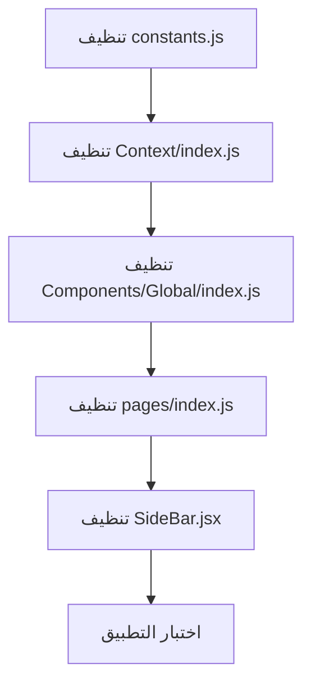

# خطة تنظيف التطبيق الطبي

## ملاحظة مهمة

بما أن العقد الذكي منشور مع بيانات، سنبقي على **Pinata/IPFS** لأن العقد يعتمد على `IPFS_URL` لتخزين واسترجاع بيانات الدكاترة والمرضى.

---

## الوظائف التي ستبقى

1. **تسجيل الدكتور والمريض** - كما هي
2. **الدكتور يكتب وصف للمريض** (`UPDATE_PATIENT_MEDICAL_HISTORY`)
3. **المريض يشوف الوصف** (عبر `MedicialHistory` و `Profile`)
4. **المواعيد** - كما هي
5. **Ethereum/MetaMask** - كما هو
6. **الإشعارات** - كما هي

---

## ما سيتم حذفه/إخفاؤه

### 1. مكون AI (OpenAI)

- ملف: [`Components/Global/AI/AI.jsx`](Components/Global/AI/AI.jsx)
- وظيفة: `ASK_AI_CHAT` في [`Context/constants.js`](Context/constants.js)
- import OpenAI في constants.js

### 2. مكونات Medicine/Shop

- مجلد: `Components/Global/Medicine/`
- مجلد: `Components/Global/Shop/`
- مجلد: `Components/Global/Admin/AddMedicine/`
- وظائف المتعلقة بـ Medicine في [`Context/index.js`](Context/index.js) و [`Context/constants.js`](Context/constants.js)

### 3. مكون Order

- مجلد: `Components/Global/Order/`

### 4. مكون Chat

- مجلد: `Components/Global/Chat/`
- مجلد: `Components/Global/ChatBox/`
- وظيفة: `SEND_MESSAGE` في Context

### 5. مكون Prescription (وصف الأدوية)

- مجلد: `Components/Global/Prescription/`

---

## الملفات الرئيسية التي ستتعدل

### [`Context/constants.js`](Context/constants.js)

- إزالة import و config الـ OpenAI (سطور 3, 8-12)
- إزالة وظيفة `ASK_AI_CHAT` (سطور 1068-1099)
- إبقاء وظائف Medicine/Order للعقد (لكن لن تستخدم في الواجهة)

### [`Context/index.js`](Context/index.js)

- إزالة وظائف Medicine من exports: `ADD_MEDICINE`, `UPDATE_MEDICINE_*`
- إزالة `SEND_MESSAGE`, `BUY_MEDICINE`
- إزالة `PRESCRIBE_MEDICINE`

### [`Components/Global/index.js`](Components/Global/index.js)

- إزالة imports و exports للمكونات المحذوفة: `AI`, `Chat`, `Shop`, `Medicine`, `Order`, `AddMedicine`

### [`pages/index.js`](pages/index.js)

- تحديث الـ imports
- إزالة الـ components المحذوفة من الـ render

### [`Components/Global/SideBar/SideBar.jsx`](Components/Global/SideBar/SideBar.jsx)

- التأكد من إخفاء الروابط المحذوفة (معظمها مخفي بالفعل)
- إزالة الـ imports غير المستخدمة

---

## خطوات التنفيذ

---

## ملاحظة أمان

- لن نحذف الملفات فعلياً، بل سنزيل الـ imports والـ exports
- هذا يضمن عدم كسر التطبيق إذا كان هناك مرجع مخفي
- يمكنك حذف المجلدات يدوياً لاحقاً بعد التأكد من عمل التطبيق